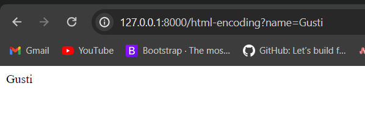
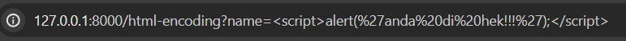
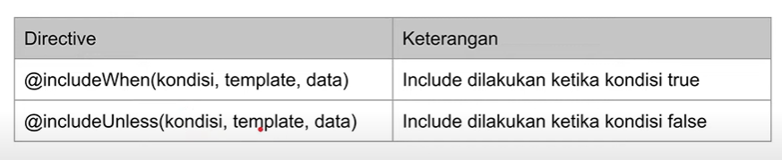
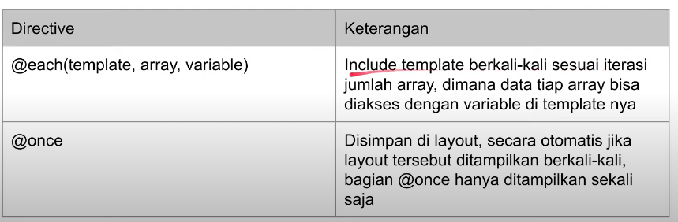
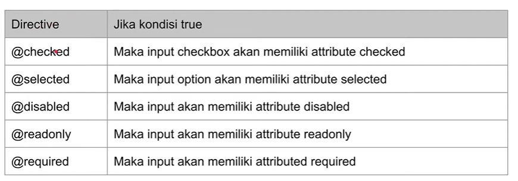

# LARAVEL BLADE TEMPLATE

## POINT UTAMA

### 1. Instalasi

-   Minimal PHP versi 8 atau lebih,

-   Composer versi 2 atau lebih,

-   Lalu pada cmd ketikan `composer create-project laravel/laravel=v9.3.8 belajar-laravel-blade-template`.

---

### 2. Blade Template

-   `Blade` adalah fitur di `Laravel` yang digunakan untuk mempermudah dalam pembuatan tampilan halaman web HTML.

-   Dengan `Blade`, bisa mempermudah membedakan logic aplikasi dengan kode tampilan yang tersimpan didalam folder `resources/view`.

-   Di `Blade` kita bisa membuat _variable_ yang nantinya _variable_ tersebut akan dipanggila untuk menampilkan halaman web.

-   Cara membuat _variable_ pada `Blade` bisa menggunakan `{{ $nama }}`.

-   Contoh kode sederhana `blade` dan variablenya

    ```HTML
    <html>

    <head>
        <title>{{ $name }}</title>
    </head>

    <body>
        <h1>{{ $name }}</h1>
    </body>

    </html>
    ```

-   Setelah membuat _view_ selanjutkan untuk me-render (menampilkan) _view_ tersebut didalam `Router`.

-   Kode route untuk menampilkan _view_

    ```PHP
    Route::get('/hello', function () {
    return view('hello', [
        "name" => "Gusti"
        ]);
    });
    ```

-   Unit test untuk menjalankan _view_

    ```PHP
    public function testHello()
    {
        $this->get("/hello")
            ->assertSeeText("Gusti");
    }
    ```

---

### 3. Nested View Directory

-   _View_ juga bisa disimpan didalam directory lagi didalam _views_.

-   Ini bisa memudahkan untuk management _view_ apabila sudah banyak membuat _view_.

-   Dan untuk mengambil _view_ bisa diganti dengan menggunakan `.` (titik), jadi tidak menggunakan `/` (slash) lagi.

-   Kode route dengan menggunakan `.` (titik)

    ```PHP
    Route::get('/world', function () {
    return view('hello.world', [
        "name" => "Gusti"
        ]);
    });
    ```

-   Unit test menjalankan _view_

    ```PHP
    public function testHelloWorld()
    {
        $this->get("/world")
            ->assertSeeText("Gusti");
    } // untuk unit test sama saja
    ```

---

### 4. Test View Tanpa Routing

-   Biasanya digunakan untuk mengirim _email_.

    ```PHP
     public function testHelloView()
    {
        $this->view("hello", ["name" => "Gusti"])
            ->assertSeeText("Gusti");
    }
    ```

---

### 5. Comment

-   `Blade` juga mendukung komentar dengan menggunakan `{{-- isi komentar --}}`.

-   Isi dari komentar tidak akan dieksekusi dan juga tidak ditampilkan di HTML nya.

-   Kode komentar pada `blade`

    ```HTML
    <html>

    <head>
        <title>Comment</title>
    </head>

    <body>
        {{-- Gusti --}}
        <h1>Comment</h1>
    </body>

    </html>
    ```

-   Unit test `blade` dengan commnet

    ```PHP
    public function testComment()
    {
        $this->view("comment", [])
            ->assertSeeText("Comment")
            ->assertDontSeeText("Gusti");
    }
    ```

---

### 6. HTML Encoding

-   Saat menggunakan `{{  }}` pada `blade` secara otomatis `blade` akan memanggil _function_ `htmlspecialchars()`, yang memastikan data aman dari tag HTML yang bisa menyebabkan XXS Attack (Cross Site Scripting).

-   Namun jika tetap ingin manampilkan data tanpa di escepe bisa menggunakan `{{ !$variable! }}`.

-   Kode `blade` html-encoding

    ```HTML
    <html>

    <head>
        <title>HTML Encoding</title>
    </head>

    <body>
        {{-- {!! $name !!} --}}
        {{ $name }}
    </body>

    </html>
    ```

-   Kode route html-encoding

    ```PHP
    Route::get('/html-encoding', function (\Illuminate\Http\Request $request) {
    return view("html-encoding", ["name" => $request->input("name")]);
    });
    ```

    

-   Hal ini cukup berbahaya apalagi jika parameter tersebut diganti javascript, bisa saja orang mengambil session user.

    

---

### 7. Disabled Blade

-   `@` Adalah cara untuk menonaktifkan sebagian atau seluruh kode `blade` di dalam template `Laravel`. Ini sering digunakan ketika Anda ingin sementara mengabaikan atau menonaktifkan blok kode tertentu di dalam tampilan Anda.

-   Atau jika ingin menonaktifkan langsung banyak kode `blade` bisa menggunakan `@verbatim` dan diakhiri `@endverbatim`

-   Kode disabled `blade`

    ```HTML
     <html>

    <body>

        <h1>Hello @{{ $name }}</h1>


        @verbatim
            <p>
                Hello {{ $name }}
                Hello {{ $name }}
                Hello {{ $name }}
                Hello {{ $name }}
            </p>
        @endverbatim

    </body>

    </html>

    ```

-   Unit test disabled `blade`

    ```PHP
    public function testDisabled()
    {
        $this->view("disabled", ["name" => "Gusti"])
            ->assertDontSeeText("Gusti")
            ->assertSeeText('Hello {{ $name }}');
    }
    ```

---

### 8. If Statement

-   `Blade` juga mendukung percabangan _if_ menggunakan perintah `@` seperti `@if`, `@elseif`.

-   Kode if statement pada `blade`

    ```PHP
    <html>

    <body>
        <p>
            @if (count($hobbies) == 1)
                I have one hobby!
            @elseif(count($hobbies) > 1)
                I have multiple hobbies!
            @else
                I don't have any hobbies!
            @endif
        </p>
    </body>

    </html>

    ```

-   Unit test if statement

    ```PHP
     public function testIf()
    {
        $this->view("if", ["hobbies" => []] )
            ->assertSeeText("I don't have any hobbies!", false);

        $this->view("if", ["hobbies" => ["Coding"]] )
            ->assertSeeText("I have one hobby!");

        $this->view("if", ["hobbies" => ["Coding", "Gaming"]] )
            ->assertSeeText("I have multiple hobbies!");
    }
    ```

---

### 9. Isset & Empty

-   `Blade` juga memiliki directive `@isset` & `@empty`.

-   `@isset` digunakan untuk mengecek apakah sebuah _variable_ ada dan tidak bernilai _null_.

-   `@empty` digunakan untuk mengecek sebuah _variable_ merupakan _array_ kosong.

-   Kode isset & empty

    ```PHP
    <html>

    <body>

        <p>
            @isset($name) // @isset
                Hello, my name is {{ $name }}
            @endisset
        </p>

        <p>
            @empty($hobbies) // @empty
                I don't have any hobbies.
            @endempty
        </p>

    </body>

    </html>
    ```

-   Unit test isset & empty

    ```PHP

    public function testIssetAndEmpty()
    {
        $this->view("isset-empty", [])
            ->assertDontSeeText("Hello")
            ->assertSeeText("I don't have any hobbies.", false);

        $this->view("isset-empty", ["name" => "Gusti"])
            ->assertSeeText("Hello, my name is Gusti")
            ->assertSeeText("I don't have any hobbies.", false);

        $this->view("isset-empty", ["name" => "Gusti", "hobbies" => ["Coding"]])
            ->assertSeeText("Hello, my name is Gusti")
            ->assertDontSeeText("I don't have any hobbies.", false);
    }
    ```

---

### 10. Environment

-   Didalam `blade` kita bisa menggunakan directive `@env(name)` atau `@env([name1, name2])`, untuk mengecek apakah sedang menggunakan environment tersebut atau tidak.

-   Kode `blade` env

    ```HTML
    <html>

    <body>

        @env('testing')
        This is test environment
        @endenv

    </body>

    </html>`

    ```

-   Unit test env

    ```PHP
     public function testEnv()
    {
        $this->view("env", [])
            ->assertSeeText("This is test environment");
    }
    ```

---

### 11. CSS Class

-   Anda dapat menggunakan CSS classes pada elemen HTML dengan cara yang sama seperti yang Anda lakukan dalam HTML biasa.

-   Kode `blade` css class

    ```HTML
    <html>

    <head>
        <style>
            .red {
                color: red;
            }

            .bold {
                font-weight: bold;
            }
        </style>
    </head>

    <body>
        @foreach ($hobbies as $hobby)
            <li @class(['red', 'bold' => $hobby['love']])>{{ $hobby['name'] }}</li>
        @endforeach
    </body>

    </html>
    ```

-   Unit test css class

    ```PHP
    public function testClass()
    {
        $this->view("class", ["hobbies" => [
            [
                "name" => "Coding",
                "love" => true
            ],
            [
                "name" => "Gaming",
                "love" => false
            ]
        ]])
            ->assertSee('<li class="red bold">Coding</li>', false)
            ->assertSee('<li class="red">Gaming</li>', false);
    }
    ```

---

### 12. Include

-   Directive `@include` digunakan untuk mengambil file template di tempat yang berbeda.

-   Kode `blade` yang akan dipanggil

    ```PHP
    @isset($title)
    <h1>{{ $title }}</h1>
    @else
        <h1>Gusti Alifiraqsha Akbar</h1>
    @endisset

    // parameter tambahan
    @isset($description)
        <p>{{ $description }}</p>
    @endisset
    ```

-   Kode `blade` yang memanggil

    ```PHP
    <html>

    <body>
        @include('header', ['description' => 'Selamat Datang di Website Kami'])
        <p>Selamat Datang di Web</p>
    </body>

    </html>
    ```

-   Unit test include `blade`

    ```PHP
    public function testInclude()
    {
        $this->view("include", [])
            ->assertSeeText("Gusti Alifiraqsha Akbar")
            ->assertSeeText("Selamat Datang di Website Kami")
            ->assertSeeText("Selamat Datang di Web");

        // test include parameter tambahan
        $this->view("include", ["title" => "Gusti"])
            ->assertSeeText("Gusti")
            ->assertSeeText("Selamat Datang di Website Kami")
            ->assertSeeText("Selamat Datang di Web");
    }
    ```

---

### 13. Include Condition

-   Ini digunakan jika ingin menampilkan directive tertentu,

-   Maka gunakan directive `@if` untuk melakukan pengecekan kondisi, apakah kondisi tertentu terpenuhi atau tidak.

-   Berikut include condition directive

    

-   kode `blade` include condition

    ```PHP
    <html>

    <body>
        @includeWhen($user['owner'], 'header-admin')
        <p>Selamat Datang {{ $user['name'] }}</p>
    </body>

    </html>
    ```

-   unit test include condition

    ```PHP
    public function testIncludeCondition()
    {
        // kondisi ketika owner true,
        $this->view("include-condition", [
            "user" => [
                "name" => "Gusti",
                "owner" => true
            ]
        ])
            // makan tampilkan "Selamat datang owner"
            ->assertSeeText("Selamat Datang Owner")
            ->assertSeeText("Selamat Datang Gusti");
        // kondisi ketika owner false,
        $this->view("include-condition", [
            "user" => [
                "name" => "Gustii",
                "owner" => false
            ]
        ])
            // makan jangan tampilkan "Selamat datang owner"
            ->assertDontSeeText("Selamat Datang Owner")
            ->assertSeeText("Selamat Datang Gusti");
    }
    ```

---

### 14. Each & Once

-   `@each` digunakan untuk mengulangi tampilan `blade` untuk setiap item dalam array atau koleksi. Ini sangat berguna ketika ingin menampilkan beberapa elemen HTML dengan struktur yang sama untuk setiap item dalam array.

-   `@once` digunakan untuk mengambil tampilan `blade` hanya sekali. Ini berguna ketika ingin memasukkan bagian tertentu dari tampilan `blade` tetapi ingin memastikan itu hanya dimasukkan sekali, bahkan jika ingin memasukkan tampilan yang mengandung `@once` beberapa kali.

-   Berikut directive each & once

    

-   Contoh kode

    ```PHP
    <html>

    <body>
        @each('user', $users, 'user')
    </body>

    </html>
    ```

-   Unit test

    ```PHP
    public function testEach()
    {
        $this->view("each", ["users" => [
            [
                "name" => "Gusti",
                "hobbies" => ["Coding", "Gaming"]
            ],
            [
                "name" => "Kiana",
                "hobbies" => ["Coding", "Gaming"]
            ]
        ]])
        // ini harus berurutan
            ->assertSeeInOrder([
                ".red",
                "Gusti",
                "Coding",
                "Gaming",
                "Kiana",
                "Coding",
                "Gaming"
            ]);
    }
    ```

---

### 15. Form Diective

-   Digunakan untuk mempermudah dalama membuat form,

-   Kondisi pada form directive merupakan _boolean_ jika _true_, maka secara otomatis directive tersebut akan dijalankan.

-   Detail form directive

    

-   Kode `blade` form directive

    ```HTML
    <html>

    <body>
        <form action="">
            <input type="checkbox" @checked($user['premium']) value="Premium" /> <br />
            <input type="text" value="{{ $user['name'] }}" @readonly(!$user['admin']) /> <br />
        </form>
    </body>

    </html>
    ```

-   Unit test form directive

    ```PHP
    public function testForm()
    {
        // kondisi jika admin true
        $this->view("form", ["user" => [
            "premium" => true,
            "name" => "Gusti",
            "admin" => true
        ]])
            ->assertSee("checked")
            ->assertSee("Gusti")
            ->assertDontSee("readonly");

        // kondisi jika admin false
        $this->view("form", ["user" => [
            "premium" => false,
            "name" => "Gusti",
            "admin" => false
        ]])
            ->assertDontSee("checked")
            ->assertSee("Gusti")
            ->assertSee("readonly");
    }
    ```

### 16. CSRF (Cross Site Request Forgery)

-   `Blade` memiliki directive `@csrf` yang bisa digunakan untuk mempermudah dalam menambahkan token CSRF di form kita.

-   Ini berguna saat kita mengirim HTTP post ke aplikasi `laravel` kita, `laravel` akan mengecek token CSRF untuk memastikan bahwa request tersebut benar berasal dari web kita.

-   Kode csrf

    ```HTML
    <html>

    <body>
        <form action="" method="post">
            @csrf
            <input type="text" name="name">
            <input type="submit" name="Send">
        </form>
    </body>

    </html>
    ```

-   Unit test csrf

    ```PHP
    public function testCSRF()
    {
        $this->view("csrf", [])
            ->assertSee("hidden")
            ->assertSee("_token");

    }
    ```

---

## PERTANYAAN & CATATAN TAMBAHAN

-   Blade adalah template yang disediakan oleh framework Laravel. Ini digunakan untuk membuat tampilan web aplikasi dengan menggunakan sintaks yang bersih, ekspresif, dan mudah dibaca.

---

### KESIMPULAN

-
